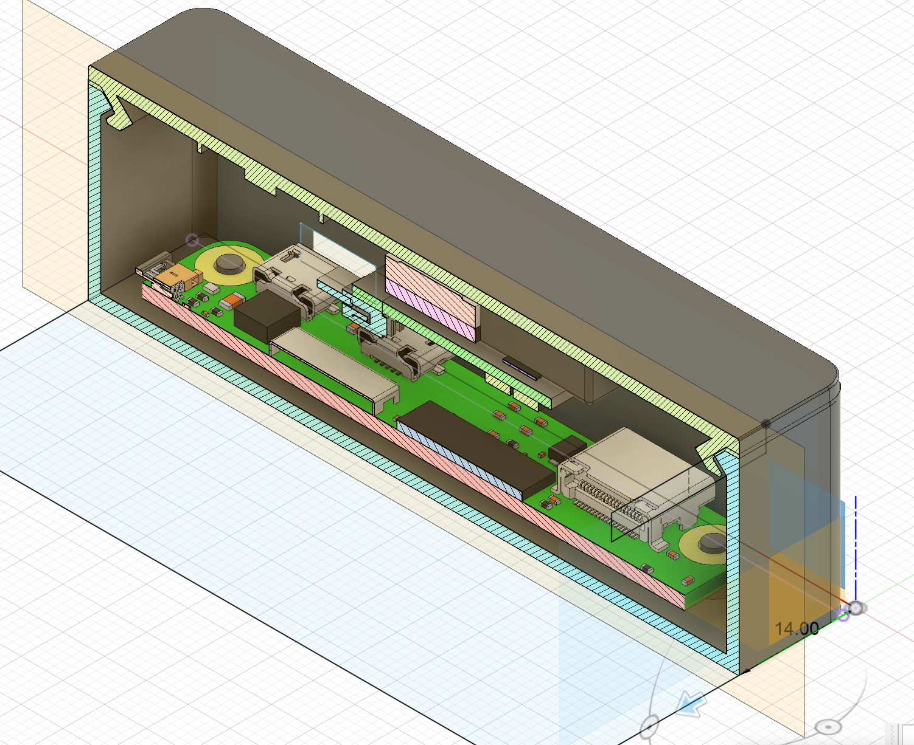
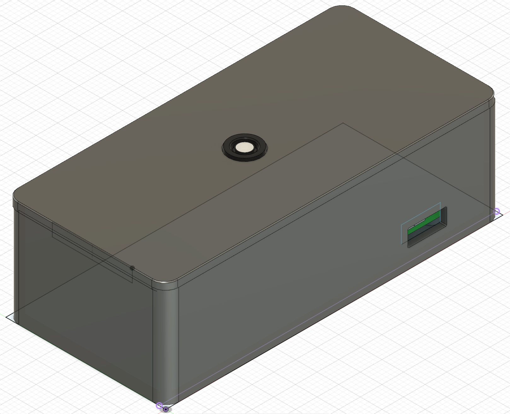
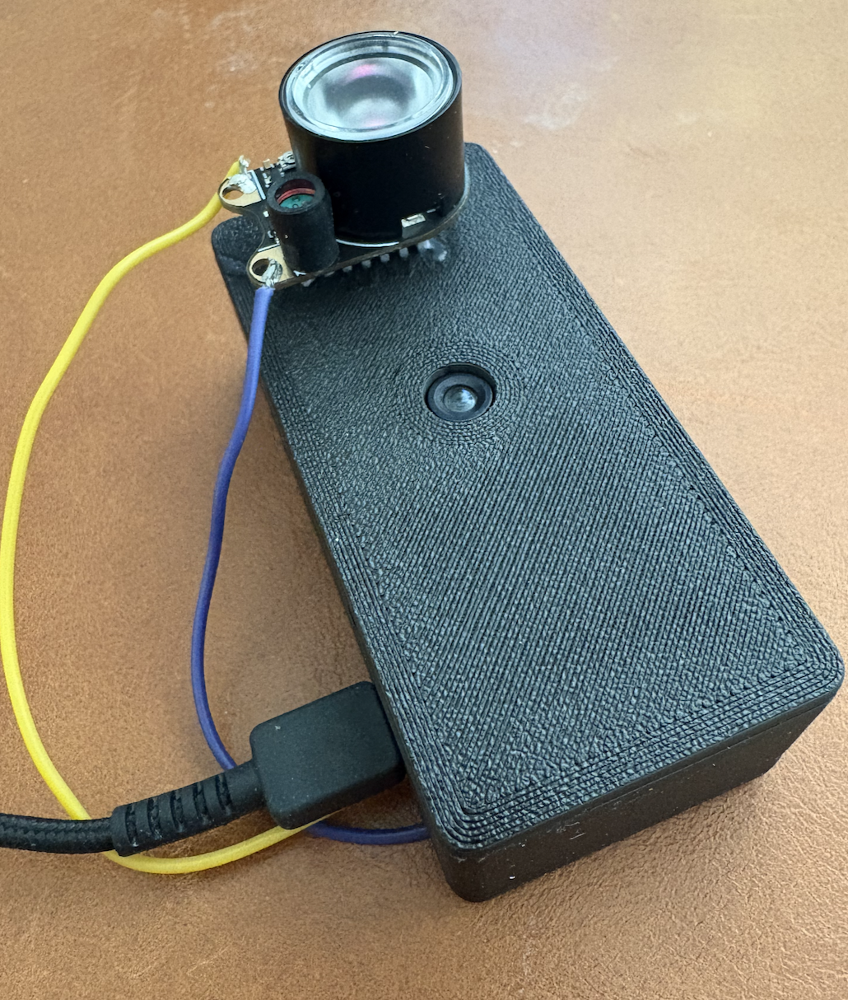
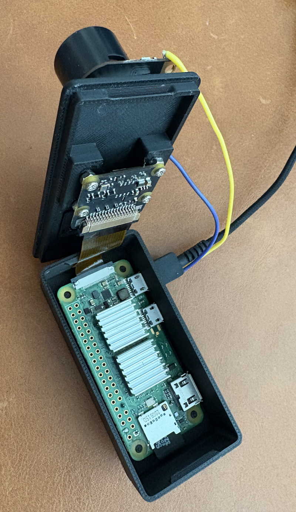

# Python web server for handling pi camera on rpi zero 2w
Not using another software because of performance.
Also not to using any django or flask for web backend to keep the size down.

## install 
sudo apt install python3-picamera2 --no-install-recommends
sudo apt-get install python3-opencv

### user
sudo useradd camerauser
sudo chown camerauser cert.pem
sudo chown camerauser key.pem
sudo chown camerauser main.py

#### so the user can access /dev/video
sudo usermod -a -G video camerauser 

### add service
sudo nano /etc/systemd/system/camera-server.service

then start it, and enable it

### create cert
sudo openssl req -x509 -newkey rsa:4096 -keyout key.pem -out cert.pem -sha256 -days 365 -nodes -subj "/C=XX/ST=StateName/L=CityName/O=CompanyName/OU=CompanySectionName/CN=192.168.1.*"

# Images
## Cad case cross section

## Cad case 

## Case outside

## Case inside

# Development
Create env example: `python -m venv .venv`, activate it `source .venv/bin/activate` install from requirements.txt `pip install -r requirements.txt`

Mock the pin facotry if not running on gpiozero `GPIOZERO_PIN_FACTORY=mock python main.py`
With arguments: `GPIOZERO_PIN_FACTORY=mock python main.py --port 8428 --cert=/opt/cert.pem --key=/opt/key.pem -u test -p testt`
